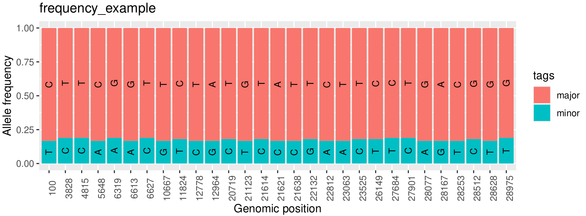
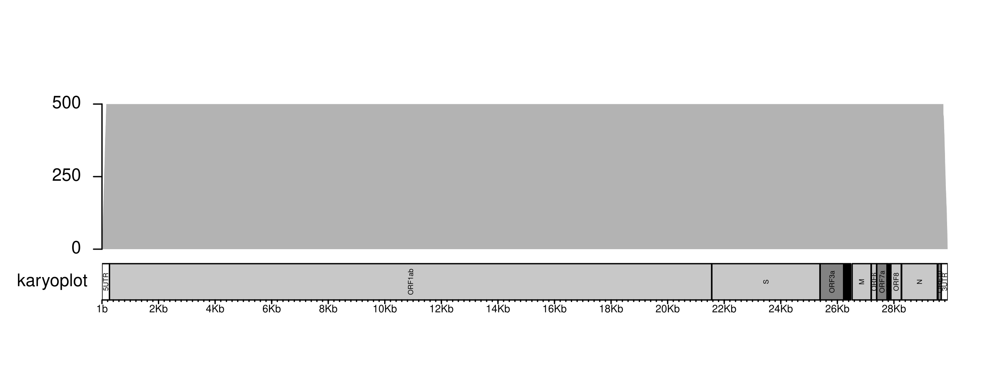

# Rscripts

This repository store different Rscripts to plot different kind of biological data. The example files can be found on example_files directory.

## frequency.R

This script use the ggplot package to create a stacked barplot of genomic positions with different allele frequencies, e.g. data of intrahost variants. The tabular file should have six columns:

- genome: The name of genome, will be used as title of barplot
- position: The genomic positions
- major_depth: The depth of major allele
- minor_depth: The depth of minor allele
- major_nuc: The symbol present as major allele
- minor_nuc: The symbol present as minor allele

### usage

```
Rscript frequency.R frequency_example.tsv
```

### result



## karyoplot.R

This script use the karyoploteR package to create a plot of sequecing depth over the genome. The rscript is configured to SARS-CoV-2 genome, for other viruses, the start and end variables should be modified in lines 23 and 25. Three files are needed:

- sorted.bam: The sorted bam file.
- sorted.bam.bai: The index of sorted bam file.
- cytobands.tsv: A tsv file with cytobands information.

The script receive 3 arguments:

```
Rscript karyoplot.R <sorted.bem> <cytobands.tsv> <sample_name>
```

### usage

```
Rscript karyoplot.R example_files/karyoplot_example.sorted.bam example_files/karyoplot_example_cytobands.tsv karyoplot
```

### result



## convert_date

This script convert YYYY-MM-DD date to decimal date format, a pattern used in several bioinformatics tools.

The script receive 2 arguments:

```
Rscript convert_date.r <input> <output>
```

### usage

```
Rscript convert_date.r example_files/date.tsv dates.csv
```

### result

```
name,date
NC_045512.2,2019.98356164384
Vietnam/VNHN_0554/2020,2020.1912568306
Venezuela/NE1428/2021,2021.37808219178
Venezuela/Mon8961/2021,2021.52054794521
Venezuela/Lar7/2021,2021.35616438356
```
